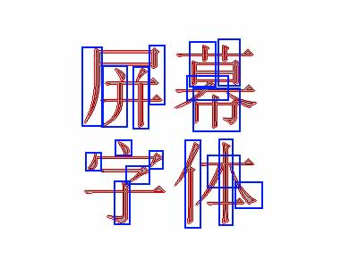

# 提宋代黑齐墨显 直辨易读行正道

**作者**：[italkit](https://github.com/italkit)

**日期**：2026 年 3 月 16 日

**摘要**：近日人大代表印海蓉在两会提议推动设立“屏幕显示用汉字字体”相关标准，并主推中国宋体取代西方等线体，引发了网友的广泛讨论。本文明确反对宋体取代黑体作为屏幕字首选字体，并给出四点理由如下：
1. 屏幕字（正文部分）应当具备快速阅读、直观辨识的特点。
2. 英文字体亦存在衬线与非衬线字体。衬线适合印刷场景，而非衬线适于屏显，所以不应当判定为文化侵蚀。
3. 中文字体存在场景惯性，线下宋体、线上黑体的习惯已经形成，打破习惯或可能导致中文的线上服务波动。
4. 中华文化崇尚多元融合，共享发展，构建华夏符号不应“逢西必反”，而应该牢牢把握定义权。

**关键词**：屏幕显示用汉字字体、印海蓉、阅读字体、文化符号。

------

2026 年 3 月 4 日和 5 日，政协和人大两会相继开幕。据网络消息[^1][^2]，人大代表印海蓉的提案之一，是“规范屏幕显示用汉字字体”，主张使用具有中文传统风格的宋体代替源自西方的等线黑体。她认为：
> ……像黑体这类无衬线字体的设计源自西方，遵循的是西方的审美和文明标识。而真正能代表中国原生书法传统和文化精髓的字体，如宋体或楷体，在调查中的认知度和使用率却较低，尤其在年轻人中。……如果在数字时代，其地位和功能被源自西方的等线体主导甚至误导，将不利于构建中华文明标识体系，也不利于增强中华文明的传播力与影响力。……

目前，我国文化产业领域取得初步成果，一系列优秀文化产品走出国门，走向世界，向世界全方位多角度展现中华优秀传统瑰宝。同时，**我国网络空间的意识形态斗争严峻**，一批“软骨病”，“慕洋派”广泛存在于网络世界，制造了大量网络声量。因此，从“加强文化认同”“构筑华夏符号”的角度看，该提案的**存在是有必要的**，**理由是充分的**。

该提案**影响广泛**，极大可能覆盖上千万个网站，影响上亿台设备；**效果深远**，极可能改变中文互联网今后未来的观感和形象。必须**行之又慎**，**广泛听取专家意见和人民声音**，**充分研判利弊**，**全面考察优缺**。使用宋体代替黑体作为屏幕显示默认字体，固然能在一定程度上起到“宣扬中华文化”和“构筑华夏符号”的作用，但真正推行宋体作为屏幕默认字体，笔者认为是不妥的。

其一，屏幕字体根据用途可以分为多个分类，适用于标题、正文、辅助小字等不同场景。**本文讨论宋体作为正文字体的情况**。正文是网站内容最主要、最重要、篇幅最大的信息呈现区域，必须达到清晰可辨，直观易读的视觉条件。在新闻、报告、小说等大量文本场景中要实现快速扫读、跳读，字体的“单位时间视觉信息量”显得尤为重要。目前成熟的等线字体产品结构匀称，笔画均匀，间架合理，从不同方向视线扫过文字段落，均能达到较高的字形辨识度，可实现近乎一目五行的优秀阅读效果[^3]。宋体的字型特点为横向笔画较细，纵向笔画较粗，点、撇、捺笔画的粗细有变。对比黑体的均匀笔画宽度，**宋体较粗的笔画区域更容易吸引更多注意力** [^4]。宋体的黑色密度分布不均，作为高信息密度区，黑色笔画呈现出**散点状**或**纵向片状**的分布特点 [^5]。这导致从任意角度扫读的阅读速度下降，会直接影响快速阅读场景下的阅读体验。

其二，英文字体也有衬线和非衬线字体的区分。非衬线字体成为屏幕显示字体的主流，与其认为西方为了文化侵蚀，不如注意到这样一个事实标准：非衬线字体作为屏幕显示字体，已经成为字体设计、网络产品设计的普遍共识——而衬线字体则多用于中西印刷场景，如报刊、书籍等。注意到这样一个逻辑：站在西方视角，衬线体和手写体密不可分，它们有许多相似之处——笔画粗细的变化、双写 f 的顶部弯曲处连写等，西方更应当“弘扬”西式手写体 / 衬线体形式，因为这是早在计算机发明之前，计算机字体设计之前，他们的文化、传承与根。

其三，中文字体的分场合使用已形成习惯。如：红头文件，印刷刊物多使用宋体，网络内容，屏幕显示多使用黑体，长篇小说多使用楷体，辅助补充内容多使用笔画较细的仿宋，古典艺术多使用隶书和小篆，自由艺术设计多使用其他风格化字体等。“线上宋体化”最直接的影响是，会搅乱既定认知中的字体用途习惯。将宋体固化为政务主要用字，可能会暂停一批线上政务软件、网站，进入维护调试状态，干扰程序和业务的正常运行和办理。将宋体推荐为网站主要用字，可能会破坏上千个主要中文网站的设计风格，破坏网站的公众印象，访客容易回忆起“店铺招牌同色一条街”等不良“一刀切”社会案例；可能会影响上万个网站的 CSS 代码，其代码需重新改写等不可计数的大范围小规模事件。将宋体固化为“华夏符号”，既是对其他传统华夏字体的打压，对并非“来自西方”黑体的停用宣判，也是分割分裂网络社群，制造更多网络喷子的潜在可能之一。

其四，中华文明是兼收并蓄的文明，中华民族是多元包容的民族。对于“来自西方”的论调，是否应当接受“来自西方”的文化，甚至早在我国建国前，就已经屡见不鲜。反打一手，反将一军，或为解决此类问题的上策：如“农历新年”的英文，究竟是否应当接受“Lunar New Year”，众说纷纭，争议较大。通过“择优覆盖、择优转化、择优输出”三步走策略，牢牢把握定义权，时刻话筒广喇叭，争夺舆论制高点，或是比较合适的方法。

[^1]: [新京报/搜狐](https://www.sohu.com/a/994699636_114988)
[^2]: [九派新闻/新浪](https://www.sina.cn/news/detail/5275026229826113.html)
[^3]: 扫视目光对阅读段落的注意力强度呈现出“首尾连线高，两侧衰减低，多方向并行推进，折线起新行 / 新列”的特点。
[^4]: 以白底黑字的扫读场景为例，黑色颜色占比更大的区域理应更容易首先看到，处于中间的文本相较于边缘文本应当更容易首先看到。
    

      
黑色面积大小与注意力实验

    
    

    

      
中心与边缘位置注意力实验

    
    

[^5]: 宋体的纵向、斜向笔画是快速辨识字形的重要点位，黑体单字笔画粗细均匀，观感连续且向四周伸展，由此段落扫读连续感强；宋体单字笔画粗细情况与黑体相差较大，由此，段落扫读注意力多为散点状和纵向片状，在横排长文本段落中缺失连续感。

    
